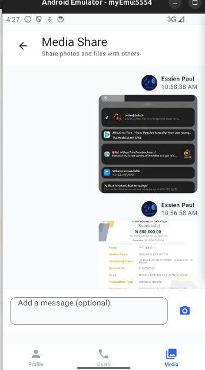
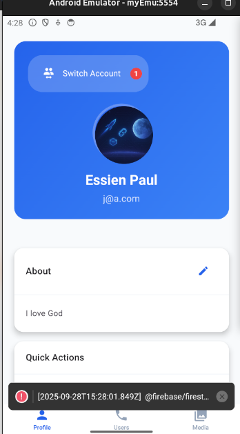
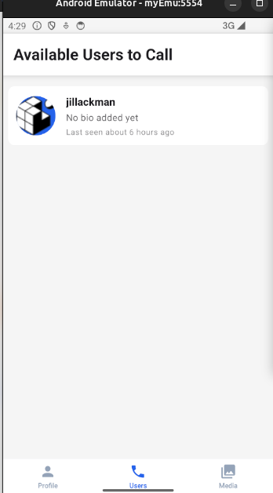
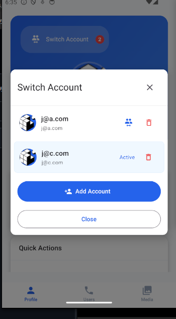
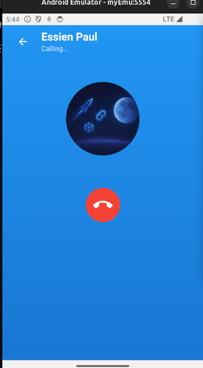
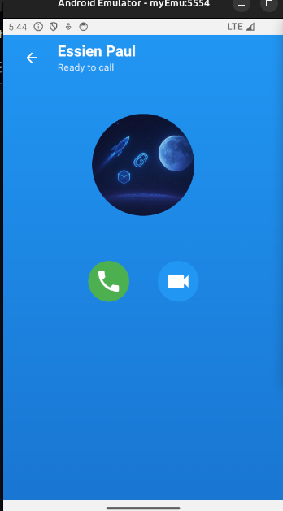
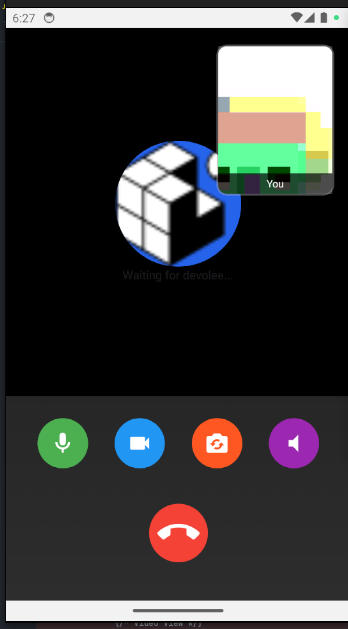

# ElexisTech Backend - React Native + Firebase Media Sharing & Calling App

A comprehensive React Native application featuring Firebase authentication, account switching, media sharing, and audio/video calling capabilities.

## ⚠️ Important: Expo Go Compatibility

**This app will NOT work with Expo Go** due to the Agora SDK's native modules requirement. The Agora SDK contains native code that cannot run in the Expo Go sandbox environment.

### Options to Run the App:

1. **Development Build (Recommended)**

   ```bash
   # Create a development build
   expo run:android
   expo run:ios
   ```

2. **Expo Go with Disabled Calling (Limited Functionality)**

   - To test the app in Expo Go, you'll need to disable the calling functionality
   - Comment out or remove the ChatScreen from the navigation
   - The app will work for authentication, profile management, and media sharing only

3. **EAS Build**
   ```bash
   # Build for production
   eas build --platform android
   eas build --platform ios
   ```

### Why This Limitation Exists:

- The Agora SDK requires native modules for audio/video calling
- Expo Go only supports JavaScript-based libraries
- Native modules need to be compiled into the app binary

## 📱 Features

- **🔐 Firebase Authentication** - Email/password login with account switching (up to 15 accounts)
- **👤 User Profiles** - Avatar uploads, bio, online status tracking
- **📞 Audio/Video Calls** - 1-to-1 calling with Firebase UID-based signaling
- **📸 Media Sharing** - Timeline interface for sharing photos and files
- **🔄 Real-time Updates** - Live data synchronization across all features
- **☁️ Cloud Storage** - Cloudinary integration for media uploads

## 📸 Screenshots

<div align="center">
  
  
  
  
  
  
  

</div>

## 🚀 Quick Start

### Prerequisites

- Node.js (v16 or higher)
- Bun (recommended) or npm/yarn
- Expo CLI
- Firebase project
- Cloudinary account

### 1. Clone and Install

```bash
git clone https://github.com/chidinma-elekwachi/elexistech-backend
cd elexistech-backend
bun install
```

### 2. Environment Setup

Create a `.env` file in the root directory:

```env
# Firebase Configuration
FIREBASE_API_KEY=your_firebase_api_key
FIREBASE_AUTH_DOMAIN=your_project.firebaseapp.com
FIREBASE_PROJECT_ID=your_project_id
FIREBASE_STORAGE_BUCKET=your_project.appspot.com
FIREBASE_MESSAGING_SENDER_ID=your_sender_id
FIREBASE_APP_ID=your_app_id
FIREBASE_DATABASE_URL=https://your_project.firebaseio.com

# Cloudinary Configuration
CLOUDINARY_CLOUD_NAME=your_cloud_name
CLOUDINARY_UPLOAD_PRESET=your_unsigned_preset

# Agora Configuration
AGORA_APP_ID=your_agora_app_id
```

### 3. Firebase Setuppa

#### Create Firebase Project

1. Go to [Firebase Console](https://console.firebase.google.com/)
2. Create a new project
3. Enable the following services:
   - **Authentication** → Email/Password
   - **Firestore Database**
   - **Storage** (optional, we use Cloudinary)

#### Configure Firestore Security Rules

```javascript
// Firestore Rules
rules_version = '2';
service cloud.firestore {
  match /databases/{database}/documents {
    // Users collection
    match /users/{userId} {
      allow read, write: if request.auth != null && request.auth.uid == userId;
      allow read: if request.auth != null; // Allow reading other users' profiles
    }

    // Media messages collection
    match /mediaMessages/{messageId} {
      allow read, write: if request.auth != null;
    }

    // Calls collection
    match /calls/{callId} {
      allow read, write: if request.auth != null;
    }
  }
}
```

#### Required Environment Variables

Make sure your `.env` file contains all the required variables:

**Firebase Variables:**

- `FIREBASE_API_KEY` - Your Firebase API key
- `FIREBASE_AUTH_DOMAIN` - Your Firebase auth domain
- `FIREBASE_PROJECT_ID` - Your Firebase project ID
- `FIREBASE_STORAGE_BUCKET` - Your Firebase storage bucket
- `FIREBASE_MESSAGING_SENDER_ID` - Your Firebase messaging sender ID
- `FIREBASE_APP_ID` - Your Firebase app ID
- `FIREBASE_DATABASE_URL` - Your Firebase database URL

**Cloudinary Variables:**

- `CLOUDINARY_CLOUD_NAME` - Your Cloudinary cloud name
- `CLOUDINARY_UPLOAD_PRESET` - Your unsigned upload preset name

**Agora Variables:**

- `AGORA_APP_ID` - Your Agora App ID for video calling

### 4. Cloudinary Setup

1. Create a [Cloudinary account](https://cloudinary.com/)
2. Create an **unsigned upload preset**:
   - Go to Settings → Upload
   - Add upload preset
   - Set signing mode to "Unsigned"
   - Set folder to "avatars" and "media-share"

### 5. Agora Setup

1. Create an [Agora account](https://console.agora.io/)
2. Create a new project
3. Get your **App ID** from the project dashboard
4. Add the App ID to your `.env` file

### 6. Run the Application

```bash
# Start the development server
bun start

# Or with Expo
expo start
```

## 🧪 Testing Features

### Authentication & Account Switching

1. **Sign Up/Login**

   - Open the app
   - Create a new account with email/password
   - Verify profile creation

2. **Account Switching**

   - Create multiple accounts (up to 15)
   - Use the "Switch Account" button in Profile screen
   - Verify seamless switching without logout

3. **Profile Management**
   - Edit profile information
   - Upload avatar (should upload to Cloudinary)
   - Verify changes persist across account switches

### Media Sharing

1. **Upload Media**

   - Navigate to "Media" tab
   - Tap camera button to select photos/files
   - Add optional message
   - Verify upload to Cloudinary

2. **View Shared Media**
   - Check that media appears in real-time timeline
   - Verify sender name and avatar display
   - Test with multiple users sharing media

### Audio/Video Calls

1. **Initiate Call**

   - Go to "Users" tab
   - Tap on a user to start call
   - Choose audio or video call
   - Verify call initialization in Firestore

2. **Receive Call**

   - Have another user call you
   - Verify incoming call notification
   - Test answer/decline functionality

3. **Call Controls**
   - Test mute/unmute
   - Test video on/off
   - Test speaker toggle
   - Test call end

## 🔧 Key Services

### AuthService

- User authentication and session management
- Account switching with credential caching
- Profile management and updates

### CallService

- Firestore-based call signaling
- Call state management
- Real-time call updates

### MediaShareService

- Media message handling
- Real-time media sharing
- Sender profile enrichment

### Cloudinary Integration

- Avatar uploads
- Media file uploads
- Automatic file optimization
